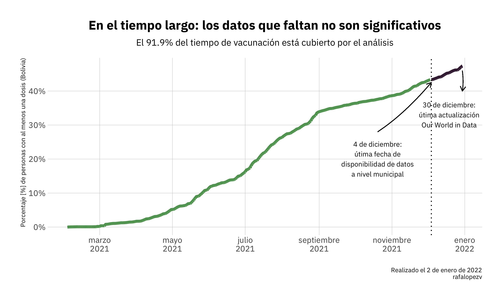
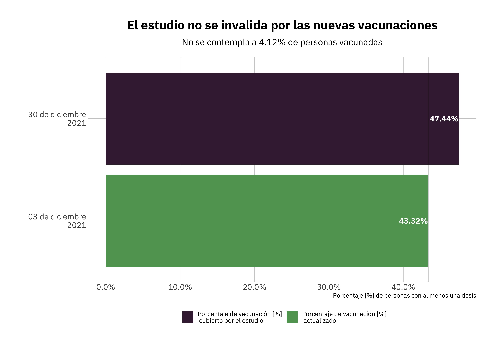

```{r setup, include=FALSE}
knitr::opts_chunk$set(echo = TRUE)
source("codigo/graficos.R")
source("codigo/estadistica.R")
```

<br>

# Estado de situación

Bolivia tiene más de 340 municipios, algunos de ellos transitaron a la autonomía indígena. En este estudio se los llamará municipios, más allá de de su estatus legal actual; esto para estandarizar la geografía del análisis. 

Un reporte liberado sobre avance de vacunación a nivel municipal muestra los siguientes escenarios paara la primera y segunda dosis al 4 de diciembre de 2021 [^1]

## Avances en la vacunación por municipio {.tabset}

<br>

### Primera dosis

```{r, echo = F}
mun_1d
```

### Segunda dosis

```{r, echo = F }
mun_2d
```

## Vea a continuación la misma información en mapa {.tabset}

<br>

### Primera dosis

```{r, echo = F }
mapa_1d
```

### Segunda dosis

```{r, echo = F }
mapa_2d
```

## ¿Porqué hay municipios con menos del 6% de vacunación y otros con más del 90%?

<br>
La hipótesis: **Por el nivel de etnicidad, el apoyo al MAS-IPSP y la pobreza**.

Para comprobarlo se ejecutaron varias regresiones líneales para verificar si **los porcentajes de primeras y segundas dosis depeenden:**

- El porcentaje de etnicidad en cada municipio
- El porcentaje de apoyo al MAS-IPSP en la elección 2020
- El porcentaje de pobreza en cada municipio

Ahora bien, aclaro los alcances de la utilización de estas variables:

<br>

|  Variable utilizada                                              | Rol de la variable                                                  | Alcances                                                                                                              |
|------------------------------------------------------------------|---------------------------------------------------------------------|-----------------------------------------------------------------------------------------------------------------------|
| Porcentaje de vacunación por municipio (primera y segunda dosis) | Efecto que se busca exlicar: ¿De qué depende esto?                  | Datos extraídos de: [Boligráfica](https://twitter.com/BoliGrafica/status/1472242459631575048)                                                                                            |
| Porcentaje de etnicidad en cada municipio                        | Causa que se busca relacionar al efecto: ¿Influye en la vacunación? | Suma de los porcentajes de auto-identificación indígena en el municipio sin importar el pueblo o nación (censo 2012) |
| Porcentaje de apoyo al MAS-IPSP en la elección 2020              | Causa que se busca relacionar al efecto: ¿Influye en la vacunación? | Porcentaje de voto a la candidatura presidencial y vicepresidencial                                                   |
| Porcentaje de pobreza en cada municipio                          | Causa que se busca relacionar al efecto: ¿Influye en la vacunación? | Porcentaje de población en condiciones de pobreza (Censo 2012)                                                      |

# Resultados

Inicialmente se verificó cuan relacionadas están las causas planteadas (etnicidad, voto al MAS-IPSP y pobreza) con la vacunación en primera y segunda dosis [^2]

## Relación entre vacunación y voto a favor del MAS-IPSP {.tabset}

<br>

### Primera dosis

```{r, echo = F }
scatter_mas_d1
```

### Segunda dosis

```{r, echo = F }
scatter_mas_d2
```

## Relación entre vacunación y etnicidad {.tabset}

<br>

### Primera dosis

```{r, echo = F }
scatter_in_d1
```

### Segunda dosis

```{r, echo = F }
scatter_in_d2
```

## Relación entre vacunación y pobreza {.tabset}

<br>

### Primera dosis

```{r, echo = F }
scatter_pobre_d1
```

### Segunda dosis

```{r, echo = F }
scatter_pobre_d2
```

# Inspecciónn sobre la relación: vacunación, etnicidad, votación y pobreza

Hasta acá se han visto estas relaciones de forma binomial, es decir, una contra otra. Pero para analizar su impacto cuando las otras están presentes hice un par de regresiones múltiples lineales que colaboran con la respuesta a la pregunta.

Hice estas regresiones:

- **A nivel Bolivia**
  + Vacunación en primera y segunda dosis como efecto y votación a favor del MAS-IPSP, nivel de etnicidad y pobreza como causas

- **A nivel departamento de La Paz**
  + Vacunación en primera y segunda dosis como efecto y votación a favor del MAS-IPSP, nivel de etnicidad y pobreza como causas

<br>

### Resultados a nivel Bolivia, primera dosis

#### De forma literal

- Si hubieraa (que no hay) un municipio que votó 0% al MAS-IPSP y que tuviera 0% de población indígena y %0 de pobreza la tasa de vacunación alzanzaría a 101%

- Por cada punto porcentual de existencia de etnicidad, el 101% se reduce en 0.11%. Es decir, un municipio com 10% de población indígena recibiría 1,11% menos de la vacunación ideal, que es 101%

- Por cada punto porcentual de votación al MAS-IPSP, el 101% se reduce en 0.13%

- Por cada punto porcentual de población pobre, el 101% se reduce en 0.48%

Todo lo anterior puede decirse con un 90% de probabilidad de estar en lo correcto y 10% de estar equivocados

#### De forma estadística

```{r, echo = F }
resultado_es1_d1
```

<br>

### Resultados a nivel Bolivia, segunda dosis

#### De forma literal

- Si hubieraa (que no hay) un municipio que votó 0% al MAS-IPSP y que tuviera 0% de población indígena y %0 de pobreza la tasa de vacunación alzanzaría a 90%

- No se puede afirmar sin el riesgo de estar equivocados que etnicidad influye en la vacunación de segunda dosis

- Por cada punto porcentual de votación al MAS-IPSP, el 101% se reduce en 0.11%

- Por cada punto porcentual de población pobre, el 101% se reduce en 0.48%

Todo lo anterior puede decirse con un 90% de probabilidad de estar en lo correcto y 10% de estar equivocados


#### De forma estadística

```{r, echo = F }
resultado_es1_d2
```

<br>

### Resultados del departamento de La Paz, primera dosis

#### De forma literal

- Si hubieraa (que no hay) un municipio que votó 0% al MAS-IPSP y que tuviera 0% de población indígena y %0 de pobreza la tasa de vacunación alcanzaría a 84%

- Por cada punto porcentual de existencia de etnicidad, el 101% se reduce en 0.39%. Es decir, un municipio com 10% de población indígena recibiría 3,9% menos de la vacunación ideal, que es 84%

- No se puede afirmar sin el riesgo de estar equivocados que el voto a favor del MAS-IPSP influye en la vacunación de segunda dosis

- Por cada punto porcentual de población pobre, el 84% se reduce en 0.4%

Todo lo anterior puede decirse con un 90% de probabilidad de estar en lo correcto y 10% de estar equivocados


#### De forma estadística

```{r, echo = F }
resultado_es1_d1_lpz
```

<br>

### Resultados del departamento de La Paz, segunda dosis

#### De forma literal

- Si hubiera (que no hay) un municipio que votó 0% al MAS-IPSP y que tuviera 0% de población indígena y %0 de pobreza la tasa de vacunación alcanzaría a 74%

- Por cada punto porcentual de existencia de etnicidad, el 101% se reduce en 0.32%. Es decir, un municipio com 10% de población indígena recibiría 3,2% menos de la vacunación ideal, que es 84%

- No se puede afirmar sin el riesgo de estar equivocados que el voto a favor del MAS-IPSP influye en la vacunación de segunda dosis

- Por cada punto porcentual de población pobre, el 74% se reduce en 0.36%

Todo lo anterior puede decirse con un 90% de probabilidad de estar en lo correcto y 10% de estar equivocados


#### De forma estadística

```{r, echo = F }
resultado_es1_d2_lpz
```


```{r, echo = F }
resultado_es1_d2_lpz
```

# Sobre el estudio

- La información tiene carácter público

- Sin embargo, los datos sobre vacunación se recogieron de [Boligráfica](https://twitter.com/BoliGrafica/status/1472242529848500226) y se asumen como validos

- Los datos sobre vacunación municipal concluyen el 12 de diembre del 2021. Sin embargo, asumiéndolos como verdaderos, no afectan a la naturaleza del estudio como puede verse en los siguientes gráficos




<br>



- Todo el código puede verse y usarse en [este enlace](https://twitter.com/BoliGrafica/status/1472242529848500226), el mismo contiene:

  + Código de programación de página web, test estadísticos, arreglo de infomración, gráficos y tablas
  + Gráficos


[^1]: Más adelante se mostrará porque este rezago de información no invalida el análisis
[^2]: Se realizaron correlaciones 'Pearson', los resultados se los multiplicó por 100 para entender el parentezco entre ambas variables de forma más natural.
